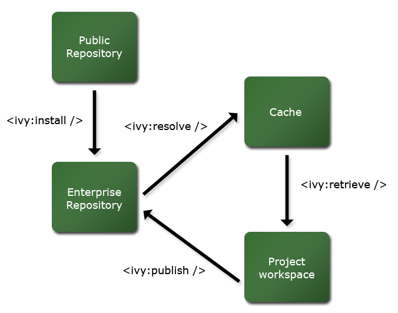

////
   Licensed to the Apache Software Foundation (ASF) under one
   or more contributor license agreements.  See the NOTICE file
   distributed with this work for additional information
   regarding copyright ownership.  The ASF licenses this file
   to you under the Apache License, Version 2.0 (the
   "License"); you may not use this file except in compliance
   with the License.  You may obtain a copy of the License at

     https://www.apache.org/licenses/LICENSE-2.0

   Unless required by applicable law or agreed to in writing,
   software distributed under the License is distributed on an
   "AS IS" BASIS, WITHOUT WARRANTIES OR CONDITIONS OF ANY
   KIND, either express or implied.  See the License for the
   specific language governing permissions and limitations
   under the License.
////

The main and most frequent way to use Ivy is from an Ant build file. However, Ivy can also be run as a standalone application.

If you use Ant version *1.6.0* or superior, you just have to add Ivy's namespace to your project (`xmlns:ivy="antlib:org.apache.ivy.ant"` attribute of your project tag), and you can call Ivy tasks.

If you want to make your build handle ivy.jar in either Ant lib dir or a local lib dir, you can use a taskdef like this:

[source,xml]
----
<path id="ivy.lib.path">
    <fileset dir="path/to/dir/with/ivy/jar" includes="*.jar"/>
</path>
<taskdef resource="org/apache/ivy/ant/antlib.xml"
         uri="antlib:org.apache.ivy.ant" classpathref="ivy.lib.path"/>
----

Combined with the antlib definition in the project namespace, it will load Ivy classes either from your Ant lib or a local directory (`path/to/dir/with/ivy/jar` in this example).

If you use Ant *1.5.1* or superior, you have to define the tasks you use in your build file. For instance:

[source,xml]
----
  <taskdef name="ivy-configure" classname="org.apache.ivy.ant.IvyConfigure"/>
  <taskdef name="ivy-resolve" classname="org.apache.ivy.ant.IvyResolve"/>
  <taskdef name="ivy-retrieve" classname="org.apache.ivy.ant.IvyRetrieve"/>
  <taskdef name="ivy-deliver" classname="org.apache.ivy.ant.IvyDeliver"/>
  <taskdef name="ivy-publish" classname="org.apache.ivy.ant.IvyPublish"/>
----

_Note_: the tasks listed above are non exhaustive. For a complete list of tasks with the corresponding classes, see the link:https://gitbox.apache.org/repos/asf?p=ant-ivy.git;a=blob;f=src/java/org/apache/ivy/ant/antlib.xml[antlib.xml] file in Git repository or the jar file you use.

Then you can use the tasks, but check their name, following samples assume you use the Ivy namespace (ivy:xxx tasks), whereas with Ant 1.5 you cannot use namespace, and should therefore use ivy-xxx tasks if you have added the taskdefs as above.

If you use an Ant version lower than 1.5.1, you can not use the Ivy tasks... you should then run Ivy as any external program.

== Calling Ivy from Ant: first steps

Once your build file is ok to call Ivy tasks, the simplest way to use Ivy is to call the Ivy retrieve task with no parameters:

[source,xml]
----
<ivy:retrieve/>
----

This calls Ivy with default values, which might be ok in several projects. In fact, it is equivalent to:

[source,xml]
----
<target name="resolve">
    <ivy:configure/>

    <ivy:resolve file="${ivy.dep.file}" conf="${ivy.configurations}"/>

    <ivy:retrieve pattern="${ivy.retrieve.pattern}" conf="${ivy.configurations}"/>
</target>
----

Those 3 tasks follow the 3 main steps of the Ivy retrieving dependencies process:

* First the configure task tells it how it can find dependencies giving it a path to a link:settings{outfilesuffix}[settings XML file].
* Then the resolve task actually resolves dependencies described by an link:ivyfile{outfilesuffix}[Ivy file], and puts those dependencies in the Ivy cache (a directory configured in the settings file).
* Finally the retrieve task copies dependencies from the cache to anywhere you want in your file system. You can then use those dependencies to make your classpath with standard Ant paths.

To understand more accurately the behaviour of Ivy tasks, one should know that a property file is loaded in Ant by Ivy at the beginning of the configure call. This property file contains the following properties:

[source]
----
ivy.project.dir = ${basedir}
ivy.lib.dir = ${ivy.project.dir}/lib
ivy.build.artifacts.dir = ${ivy.project.dir}/build/artifacts
ivy.distrib.dir = ${ivy.project.dir}/distrib

ivy.resolver.default.check.modified = false
ivy.default.always.check.exact.revision = true

ivy.configurations = *
ivy.resolve.default.type.filter = *
ivy.status = integration
ivy.dep.file = ivy.xml
ivy.settings.file = ivysettings.xml
ivy.retrieve.pattern = ${ivy.lib.dir}/[artifact]-[revision].[ext]
ivy.deliver.ivy.pattern = ${ivy.distrib.dir}/[type]s/[artifact]-[revision].[ext]
ivy.publish.src.artifacts.pattern = ${ivy.distrib.dir}/[type]s/[artifact]-[revision].[ext]

ivy.report.output.pattern = [organisation]-[module]-[conf].[ext]

ivy.buildlist.ivyfilepath = ivy.xml

ivy.checksums=sha1,md5
----

_For the latest version of these properties, you can check the link:https://gitbox.apache.org/repos/asf?p=ant-ivy.git;a=blob;f=src/java/org/apache/ivy/core/settings/ivy.properties[Git version]._

(*__since 2.0__*) After calling the first Ivy task, the property `ivy.version` will be available and contains the version of the used Ivy library.

== Ivy tasks attributes : generalities

Some tasks attributes values may be set in different places. The three possible places are :

. task attribute
. Ivy instance
. project property

The places are queried in this order, so anything set in task attribute will override what would have been found in Ivy instance, for example.

The Ivy instance considered here is an instance of the class `Ivy`, which is set up by a call to the configure task, and then reused for other tasks. Because most of the tasks need an Ivy instance, they first check if one is available (i.e. configure has been called), and if none is available, then a default configure is called and the resulting Ivy instance is used in the remaining tasks (unless another configure is called).

It isn't generally necessary to understand this, but it can lead to some issues if you forget to call configure before another task and if the configure step was required in your environment.

== Usual cycle of main tasks

== Example

Here is a more complete example of build file using Ivy:

[source,xml]
----
<project xmlns:ivy="antlib:org.apache.ivy.ant" name="sample" default="resolve">

    <target name="resolve">
        <ivy:configure file="../ivysettings.xml"/>

        <ivy:resolve file="my-ivy.xml" conf="default, myconf"/>

    </target>

    <target name="retrieve-default" depends="resolve">
        <ivy:retrieve pattern="lib/default/[artifact]-[revision].[ext]" conf="default"/>
    </target>

    <target name="retrieve-myconf" depends="resolve">
        <ivy:retrieve pattern="lib/myconf/[artifact]-[revision].[ext]" conf="myconf"/>
    </target>

    <target name="retrieve-all" depends="resolve">
        <ivy:retrieve pattern="lib/[conf]/[artifact]-[revision].[ext]" conf="*"/>
    </target>

    <target name="deliver" depends="retrieve-all">
        <ivy:deliver deliverpattern="distrib/[artifact]-[revision].[ext]"
                     pubrevision="1.1b4" pubdate="20050115123254" status="milestone"/>
    </target>

    <target name="publish" depends="deliver">
        <ivy:publish resolver="internal"
                     artifactspattern="distrib/[artifact]-[revision].[ext]"
                     pubrevision="1.1b4"/>
    </target>
</project>
----

All Ivy tasks are documented in the following pages.
