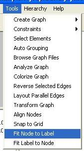
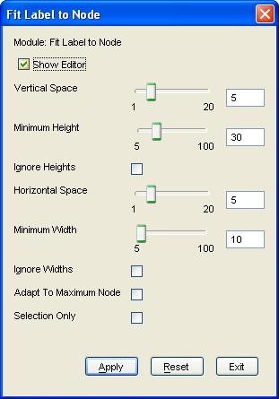
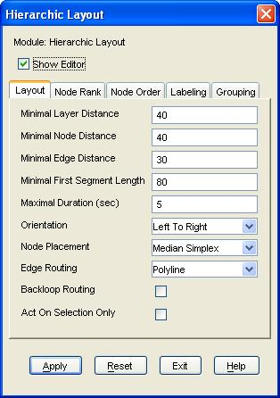

////
   Licensed to the Apache Software Foundation (ASF) under one
   or more contributor license agreements.  See the NOTICE file
   distributed with this work for additional information
   regarding copyright ownership.  The ASF licenses this file
   to you under the Apache License, Version 2.0 (the
   "License"); you may not use this file except in compliance
   with the License.  You may obtain a copy of the License at

     https://www.apache.org/licenses/LICENSE-2.0

   Unless required by applicable law or agreed to in writing,
   software distributed under the License is distributed on an
   "AS IS" BASIS, WITHOUT WARRANTIES OR CONDITIONS OF ANY
   KIND, either express or implied.  See the License for the
   specific language governing permissions and limitations
   under the License.
////

link:https://www.yworks.com/products/yed[yEd] is a free graph editor, benefiting from all the automatic layouts of yFiles. Ivy is able to generate graphs which are readable by yEd.

The graphs generated by Ivy are not laid out (in fact, it's why we use yEd), so you have to follow a simple sequence of steps to layout the generated graphs.

== Preparation

First you have to generate a GraphML file. Simply call the report task (see Ivy use documentation) for that.

== Step 1: open the GraphML file

Launch yEd editor, and open the GraphML file generated by the report task. You should obtain something like this:

image::images/yed-step1.jpg[]

== Step 2: ask yEd to adjust nodes size

image::images/yed-step3-2.jpg[]

== Step 3: ask yEd to layout nodes

image::images/yed-step4.jpg[]

image::images/yed-step6.jpg[]

That's all, you should have obtained something like this:

image::images/yed-step7.jpg[]

Note that this is only one possibility, test the available layouts yourself, you could find one better in your case.
Once you have laid out the graph, you can either save it with in the same file (but be warned that it will be overwritten at next Ivy report call), or another file, export it to JPEG, GIF, SVG, etc. (see link:https://www.yworks.com/products/yed[yEd] site for details).
